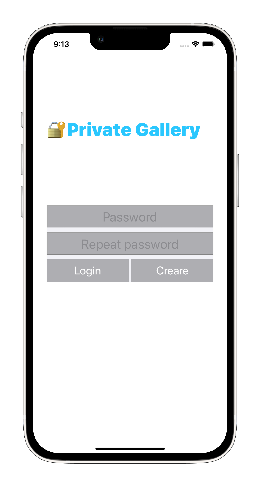
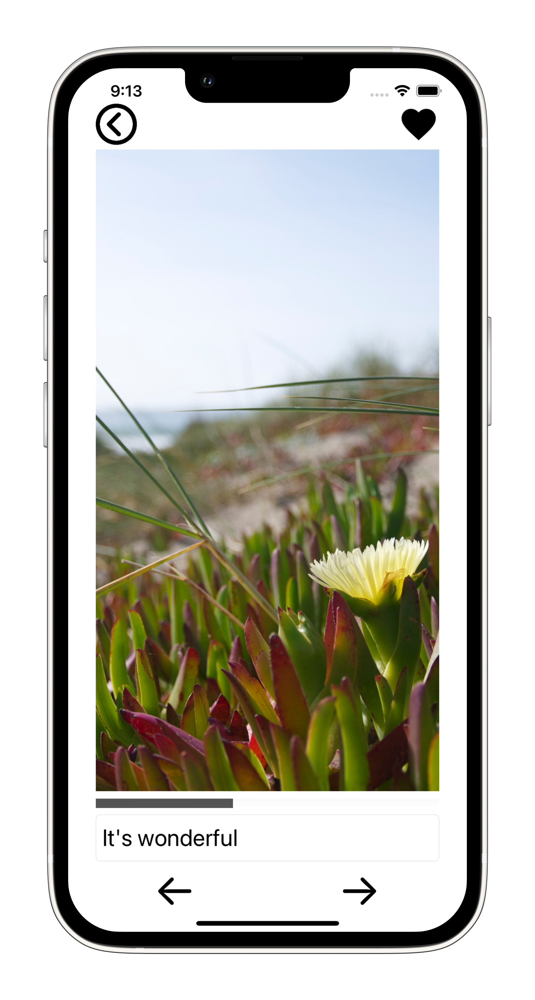

# PrivateGallery

Educational project

Additional libraries were used to build the application:
- SwiftyKeychainKit
- RxSwift
- RealmSwift

MVVM architecture is used

<table>
  <tr>
    <td></td>
    <td></td>
    <td></td>
    </tr>
 </table>

